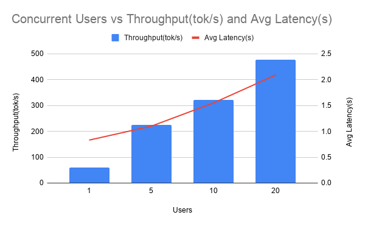

# 1 HuggingFace Inference Baseline
Goal: Get the `HuggingFaceTB/SmolLM-135M` model running locally using HuggingFace transformers. </br> 
This represents out baseline single-request performance. Under load with multiple users, requests would queue up.</br>
Why `SmolLM-135M`: A tiny 135M parameter model was chosen because my 3 year old Ryzen 7 7840HS laptop doesn't even have a GPU. The following was done as a learning experiment, so feel free for folllowing. Thanks for reading. 

1. `docker pull vllm/vllm-openai-cpu:latest-x86_64` from vLLM's website for Intel/AMD x86 CPU only pre-built images. Run `docker run -it -v ./project-files:/project-files  --entrypoint bash   vllm/vllm-openai-cpu:latest-x86_64` to use the container.  
2. Ensure that `pip show torch` shows `Version: 2.11.0+cpu` and `pip show vllm` shows `Version: 0.21.0+cpu` 
3. `from transformers import AutoModelForCausalLM, AutoTokenizer` to import the needed libraries to run the model and to tokenize prompts.
4. `model = AutoModelForCausalLM.from_pretrained("HuggingFaceTB/SmolLM-135M")` loads the pretrained language model, while `tokenizer = AutoTokenizer.from_pretrained(model_name)` loads the tokenizer associated with that model.

Since language models cannot directly understand raw text, the tokenizer converts human-readable text into numerical tokens that the model can process. These tokens represent pieces of text (words, subwords, or characters) according to the model’s vocabulary. I have printed out a couple of vocabs from the model as well as the vocab size. 

5.  `inputs = tokenizer(prompt, return_tensors="pt")`  tokenizes the input
6. `outputs = model.generate(**inputs, max_new_tokens=100, do_sample=True, temperature=0.7,)` sends the model the tokenized input prompt and generates the output. 
7. Times and calculates the # of generated tokens, total time, and tokens/sec. 
Baseline Metrics:
```
tokens_per_second=49.62
total_time=2.0155
generated_tokens=100
```
Key insights:
- This is SINGLE-REQUEST performance, so no batching - one request at a time
- Under load with multiple users, requests would queue up

# 2 vLLM Inference Setup and Comparison
Goal: Run the exact same model `HuggingFaceTB/SmolLM-135M` but using vLLM inference engine and compare the results. 
1. `from vllm import LLM, SamplingParams` import the right libraries 
2. `llm = LLM(model=model_name, max_model_len=128, enforce_eager=True)` initializes the vLLM engine with our model. `max_model_len` represents the max total number of tokens the model is allowed to keep in its context window during inference. The total prompt tokens are calculated:  input `prompt tokens` + `generated tokens` = total tokens
3. `sampling_params = SamplingParams(temperature=0.7, max_tokens=100)`  This line creates a configuration object that controls how the language model generates text.
4. `outputs = llm.generate([prompt], sampling_params)` actual answer generation by the LLM 
5. `generated_text = outputs[0].outputs[0].text` gets the generated text 

Metrics
```
Generated tokens: 50
Total time: 0.82 seconds
Tokens per second: 61.3 tok/s

--- COMPARISON: HuggingFace vs vLLM ---
Metric                HuggingFace         vLLM
----------------------------------------------
Tokens/sec                   49.8         61.3
Total time                  1.00s        0.82s
vLLM is 1.2x faster in tokens/sec
```

Insights: 
- vLLM optimizes inference even for single requests because it was designed as a high-performance LLM serving engine, where as Transformers is a general-purpose model library
- vLLM has better KV cache optimizations(explained below) 
- vLLM has more efficient memory management through PagedAttention(explained below) 

# 3 KV Cache Problem 
### KV Cache Background
During generation, the model repeatedly:
- Reads all previous tokens
- Computes attention
- Generates one new token
- Stores intermediate states
- Repeats

The expensive part is storing and managing the <b> KV cache</b>. Transformers store attention information from previous tokens so they don’t recompute everything every step(that would be very slow). </br> 
(1) The model first processes the entire prompt and computes the initial Key (K) and Value (V) tensors in the prefill phase. </br>
(2) As the LLM generates the response token-by-token, it retrieves the K/V pairs for all previous tokens from the cache, only computing the new tokens as they are produced in the decode phase. 

The max sequence length is the longest pre-allocated window of tokens per request. Aka maximum number of tokens a transformer model can process at one time. Let's do a thought experiement: if our max sequence length is 512 tokens, and we have 5 concurrent requests of varying lengths, this is what it would look like: 
```
Request 1 (Short question):
    [####..............................................] 45/512 used (91.2% wasted)
  Request 2 (Medium paragraph):
    [############......................................] 128/512 used (75.0% wasted)
  Request 3 (Quick greeting):
    [##................................................] 23/512 used (95.5% wasted)
  Request 4 (Long document):
    [#########################.........................] 256/512 used (50.0% wasted)
  Request 5 (Code snippet):
    [######............................................] 67/512 used (86.9% wasted)
```
So if we do some math, we can see that we only used 519 token slots out of 2560 allocated token slots. This results in 20.3% utilization and <b> 79.7% overall waste </b> 

### Why is this an issue?
If we have 10,000 memory slots:
- In the case of contigous allocation, that means we can serve up to 10,000/512 ~ 19 users max 
- In the idea case with no waste, we can serve 10,000/519*5 ~ 97 users max 
- 97/19 ~ 5.1x fewer users than ideal

### What is causing this issue?
1. traditional systems pre-allocate WORST-CASE memory per request
2. Short prompts waste massive amounts of memory
3. This limits how many concurrent requests you can serve
4. This is the EXACT problem vLLM's PagedAttention solves.

# 4 PagedAttention Solution 
PagedAttention is vLLM’s method for managing the KV cache efficiently during LLM inference. The core idea is instead of storing each request’s KV cache in one giant continuous block of GPU memory, split it into smaller reusable pages (blocks). The idea is very similar to virtual memory in operating systems and paging in RAM management. 

So instead of one huge contiguous allocation
```
[================================]

```
Each block stores KV cache for some tokens.
```
[block][block][block][block]
```

ow memory can be:

- dynamically allocated
- reused
- shared efficiently
- compacted naturally

No need for giant reserved chunks. Same requests as before, but now with Paged Attention, we can see 4.7x less memory usage 
```
Request 1: 45 tokens -> 3 pages (48 slots)
    Pages: [##|##|##]  waste: 6.2%
  Request 2: 128 tokens -> 8 pages (128 slots)
    Pages: [##|##|##|##|##|##|##|##]  waste: 0.0%
  Request 3: 23 tokens -> 2 pages (32 slots)
    Pages: [##|##]  waste: 28.1%
  Request 4: 256 tokens -> 16 pages (256 slots)
    Pages: [##|##|##|##|##|##|##|##|##|##|##|##|##|##|##|##]  waste: 0.0%
  Request 5: 67 tokens -> 5 pages (80 slots)
    Pages: [##|##|##|##|##]  waste: 16.2%

--- SIDE-BY-SIDE COMPARISON ---
Method          Total Allocated   Total Used   Utilization
---------------------------------------------------------
Contiguous             2560 slots      519 slots         20.3%
Paged                   544 slots      519 slots         95.4%

Memory saved: 2016 slots (4.7x less memory)
```

Here are the user concurrent user impact with 10000 total memory slots:
- Contiguous: 19 concurrent users
- Paged:      92 concurrent users
- Improvement: 4.8x more users

# 5 Build API Server 
Goal: Launch vLLM as an OpenAI-Compatible API Server
Serve SmolLM via HTTP and interact using the OpenAI Python client.

1. Setup the necessary variables. i.e.: model_name, server_url, prompt 
2. Setup python script to launch server in a Child process asynchronously. This process would be responsible for running the model as a server and be available at port 8000. `Popen` lets the server continue running in the background as a subprocess .  
```python
python -m vllm.entrypoints.openai.api_server \
    --model HuggingFaceTB/SmolLM-135M \
    --port 8000 \
    --max-model-len 128 \
    --enforce-eager
```

3. Create the client that would be able to talk to the server. Send the prompt as apart of the request to `http://localhost:8000/v1/completions` and waits for the results.
```python
client = OpenAI(base_url="http://localhost:8000/v1", api_key="not-needed")
response = client.completions.create(
        model="HuggingFaceTB/SmolLM-135M",
        max_tokens=50,
        temperature=0.7,
    )
```

4. I received the following HTTP response from the server. I computed the following metrics: 

```
--- RESPONSE ---
Model: HuggingFaceTB/SmolLM-135M
Response: 
Inference is a component of machine learning that allows an algorithm to make predictions based on data. It is a type of optimization problem in machine learning that involves finding the best parame
Latency: 1.29s
Prompt tokens: 7
Completion tokens: 50
```

### Key Insights
- vLLM serves an OpenAI-compatible API out of the box
- Any app using the OpenAI SDK works with vLLM with no code changes
- This is the theory of how LLMs are self-hosted in prod

# 6 Multiple User Simultanous Load 

Goal: Test vLLM's performance under concurrent load with multiple simultaneous users.

1. Setup a list of prompts to draw from in order to simulate different users with different request
2. Created `send_request()` function to send request to server API
3. Created `run_load_test()` function to run a load test with the given number of concurrent users 
4. Ran the experiment for 1, 5, 10, and 20 users and see how th throughput and average latency changes. 


## vLLM CPU Concurrent Users Benchmarks

| Users | Total Tokens | Time (s) | Throughput | Avg Latency | Success |
|-------|--------------|----------|------------|-------------|---------|
| 1     | 50           | 0.83s    | 60.4 tok/s | 0.83s       | 100%    |
| 5     | 250          | 1.11s    | 225.9 tok/s| 1.10s       | 100%    |
| 10    | 500          | 1.55s    | 322.6 tok/s| 1.55s       | 100%    |
| 20    | 1000         | 2.10s    | 476.5 tok/s| 2.09s       | 100%    |



### Key Observations
- Throughput scales significantly with concurrent users (60.4 → 476.5 tok/s)
- vLLM efficiently batches requests, handling 20 concurrent users with 100% success rate
- Latency increases moderately as load increases, showing good scalability
- This demonstrates vLLM's advantage over sequential request handling

# 7 Tuning vLLM Parameters for Production

Goal: Experiment with key vLLM configuration options to optimize performance for different workload patterns.

## Understanding Key Parameters

1. **max_model_len**: Maximum context length per request
   - Controls how many tokens can fit in a single request
   - Lower values = less memory per request, but limits context window
   - Trade-off between flexibility and memory efficiency

2. **max_num_seqs**: Maximum concurrent sequences in a batch
   - Controls how many requests can be processed simultaneously
   - Higher values = more concurrency but more memory usage
   - Lower values = less memory per request but reduced throughput

3. **swap_space**: CPU swap space (GB) for KV cache overflow
   - Extends capacity beyond available RAM
   - Allows handling more requests when memory is constrained
   - Performance degrades when using swap (CPU is slower than GPU memory)

## Test Configuration

Tested three different configurations with 10 concurrent requests each:

| Configuration | max_model_len | max_num_seqs | Purpose |
|---|---|---|---|
| A: Default | 128 | 256 | Baseline setup |
| B: Shorter Context | 64 | 256 | Reduce memory per request |
| C: Limited Concurrency | 64 | 8 | Test concurrency limits |

## Results

| Config | max_model_len | max_num_seqs | Throughput | Avg Latency | Total Tokens |
|---|---|---|---|---|---|
| A: Default | 128 | 256 | 350.5 tok/s | 1.42s | 500 |
| B: Shorter Context | 64 | 256 | 345.1 tok/s | 1.41s | 494 |
| C: Limited Concurrency | 64 | 8 | 221.3 tok/s | 1.55s | 500 |

### Key Observations
- **Configs A & B perform similarly** despite different context lengths, showing that max_model_len isn't the bottleneck on CPU
- **Config C shows degradation** when max_num_seqs is too restrictive (8 vs 256)
  - 37% lower throughput with limited concurrency
  - Latency increases due to queue buildup
- For CPU inference, **max_num_seqs (concurrency control) matters more than max_model_len**
- The optimal configuration depends on your specific workload:
  - High-throughput, short-context workloads → favor higher max_num_seqs
  - Memory-constrained environments → reduce max_model_len
  - Unpredictable load patterns → tune swap_space as safety net

### Key Insights
- Always tune based on YOUR workload pattern, not generic best practices
- Memory management is about trade-offs: concurrency vs per-request resources
- CPU swap space provides a safety valve but degrades performance
- Monitoring is essential to validate tuning decisions 

### TensorRT-LLM Concurrent Users GPU Benchmark

| Users | Total Requests | Success Rate | Total Tokens | Total Time (s) | Throughput | Requests/sec | Avg Latency (s) |
|-------|----------------|--------------|--------------|----------------|------------|--------------|-----------------|
| 1     | 1              | 100%         | 20           | 0.1764         | 113.35     | 5.67         | 0.1764          |
| 5     | 5              | 100%         | 82           | 0.6277         | 130.64     | 7.97         | 0.4315          |
| 10    | 10             | 100%         | 197          | 1.2503         | 157.57     | 8.00         | 0.6608          |
| 20    | 20             | 100%         | 418          | 2.8884         | 144.72     | 6.92         | 1.4625          |

#### vLLM Concurrent Users GPU Benchmark coming soon! 